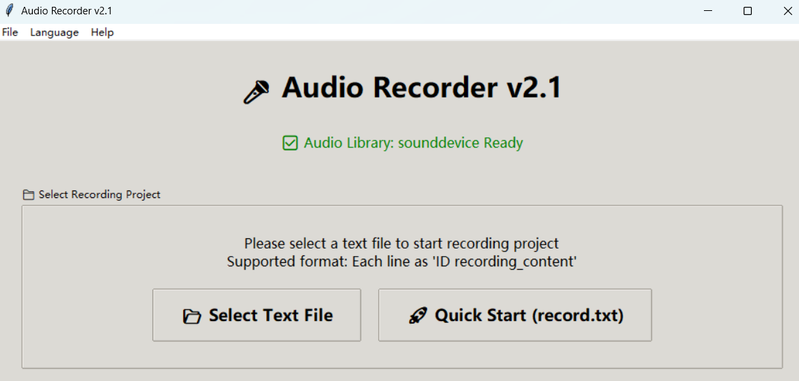

# Audio Tagger v2.1

*Read this in other languages: [简体中文](README_CN.md)*

A professional audio recording tool for batch voice recording projects, supporting multi-project management and progress saving.



## ✨ Key Features

- **Multi-file Support**: Load any text file, not limited to record.txt
- **Project Management**: Independent directories and progress management for different projects  
- **Progress Saving**: Automatically save and restore recording progress
- **Welcome Interface**: File selection interface on startup
- **Navigation Controls**: Previous/Next buttons with keyboard shortcuts
- **Smart Status**: Intelligent button control based on recording status
- **Menu System**: Complete menu bar and keyboard shortcuts
- **Multi-language Support**: Support Chinese/English interface switching 🆕
- **Configuration Integration**: Full support for config.json configuration

## 🚀 Quick Start

### 1. Install Dependencies
```bash
conda create -n audio_tagger python=3.12
conda activate audio_tagger
pip install -r requirements-minimal.txt
```

### 2. Prepare Text File
Create a text file with format:
```
000001 The first sentence to record
000002 The second sentence to record  
000003 The third sentence to record
```

### 3. Start Program

#### Standard Launch (Chinese Interface)
```bash
python audio_recorder_v2.py
```

#### Quick Launch with Specific Language
```bash
# Chinese Interface
python audio_recorder_chinese.py

# English Interface
python audio_recorder_english.py
```

#### Switch Language within Program
- Menu Bar → Language → Select 中文/English
- Restart program to take effect

### 4. Select Project
- Program shows welcome interface on startup
- Click "📂 Select Text File" to choose file to record
- Or click "🚀 Quick Start" to use record.txt (if exists)

## 🎮 Usage Guide

### Startup Process
1. **Welcome Interface**: Program shows file selection interface on startup
2. **Select File**: Manually select text file to record
3. **Auto Initialize**: Program automatically creates project directory and loads progress
4. **Start Recording**: Continue recording from last stopped position

### Recording Operations
1. **Start Recording**: Click "🎤 Start Recording" button or press Space key
2. **Stop Recording**: Click "⏹️ Stop Recording" button or press Space key again
3. **Playback Audio**: Click "🔊 Playback" button or press P key
4. **Navigation Control**:
   - Click "⏭️ Next" button or press Enter key to go to next item
   - Click "⏮️ Previous" button or press Backspace key to return to previous item
5. **Re-record**: Recorded items show "🔄 Re-record", can re-record

### Project Management
- **Switch Project**: Menu Bar → File → Switch Text File
- **Open Directory**: Menu Bar → File → Open Project Directory
- **Jump to Item**: Menu Bar → Tools → Jump to Specified Item
- **Batch Check**: Menu Bar → Tools → Batch Check Recordings

## 📁 Project Structure

```
audio_tagger/
├── audio_recorder_v2.py      # Main program
├── config.json              # Configuration file
├── record.txt               # Sample text file
├── requirements-minimal.txt # Dependencies list
└── recordings/              # Recording directory
    ├── record/              # Project directory
    │   ├── progress.json    # Progress file
    │   └── *.wav           # Recording files
    └── other_projects/
```

## ⚙️ Configuration File

Edit `config.json` file to customize audio parameters, interface settings, etc.

## 🔧 System Requirements

- Python 3.7+
- Audio libraries: sounddevice + soundfile
- Install dependencies: `pip install -r requirements-minimal.txt`

## ⌨️ Keyboard Shortcuts

| Shortcut | Function |
|----------|----------|
| Space | Start/Stop Recording |
| Enter | Next Item |
| Backspace | Previous Item |
| P Key | Playback Audio |
| Ctrl+O | Switch File |

## ❓ FAQ

### Q: How to start a new project?
A: Start the program, select a text file to automatically create a new project.

### Q: How to continue a previous project?
A: Select the same text file, the program will automatically load progress.

### Q: What to do if accidentally clicked next?
A: Use "Previous" button or press Backspace key to return.

### Q: What does "Simulation Mode" prompt mean?
A: Audio libraries not installed, run: `pip install -r requirements-minimal.txt`

### Q: No sound during recording?
A: Check microphone connection and system audio settings.

---

💡 **Tip**: If you encounter problems, check the terminal output for error messages.
