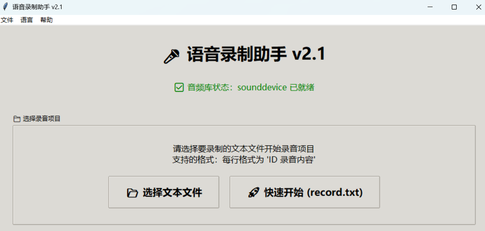

# 🎤 语音录制助手 v2.1

*其他语言版本: [English](README.md)*

一个专为批量语音录制设计的Python工具，支持多项目管理、进度保存和智能录制流程。



## ✨ 功能特性

- **多文件支持**：可加载任意文本文件进行录制
- **项目管理**：不同文本文件的录音自动保存到独立目录
- **进度保存**：自动保存录制进度，重启程序可从上次位置继续
- **智能检测**：自动检测已录制文件，智能确定录制起点
- **双向导航**：支持上一条/下一条快速切换，防止误操作
- **可视化界面**：直观的GUI界面，实时显示项目信息和录制进度
- **快捷键支持**：空格键录制，回车键下一条，退格键上一条
- **多语言支持**：支持中文/英文界面切换 🆕
- **高质量录音**：16kHz采样率，WAV格式输出

## 🚀 快速开始

### 1. 安装依赖
```bash
conda create -n audio_tagger python=3.12
conda activate audio_tagger
pip install -r requirements-minimal.txt
```

### 2. 准备文本文件
创建文本文件，每行格式为：`ID 录音内容`

示例：
```
000001 也才会有一个基于共赢框架的真正智能
000002 累计实现转移农村劳动力八零二
000003 而他的对手是世界上最危险的人
```

### 3. 启动程序

#### 标准启动（中文界面）
```bash
python audio_recorder_v2.py
```

#### 快速启动指定语言
```bash
# 中文界面
python audio_recorder_chinese.py

# 英文界面
python audio_recorder_english.py
```

#### 程序内切换语言
- 菜单栏 → 语言 → 选择中文/English
- 重启程序后生效

### 4. 选择项目
- 程序启动后显示欢迎界面
- 点击"选择文本文件"选择要录制的文件
- 程序自动创建项目目录，加载进度

## � 使用说明

### 录制操作
- **开始录制**：点击"🎤 开始录制"或按空格键
- **停止录制**：再次按空格键
- **试听音频**：点击"🔊 试听"或按P键
- **下一条**：点击"⏭️ 下一条"或按回车键
- **上一条**：点击"⏮️ 上一条"或按退格键

### 快捷键
| 按键 | 功能 |
|------|------|
| 空格键 | 开始/停止录制 |
| 回车键 | 下一条 |
| 退格键 | 上一条 |
| P键 | 试听录音 |
| Ctrl+O | 切换文本文件 |
| Ctrl+E | 打开项目目录 |
| Ctrl+G | 跳转到指定条目 |

## � 项目结构

```
audio_tagger/
├── audio_recorder_v2.py      # 主程序
├── config.json              # 配置文件
├── requirements-minimal.txt # 依赖包
└── recordings/              # 录音根目录
    ├── project1/            # 项目1
    │   ├── progress.json    # 进度文件
    │   └── *.wav           # 录音文件
    └── project2/            # 项目2
        ├── progress.json
        └── *.wav
```

## ⚙️ 配置

编辑`config.json`自定义设置：
- 音频参数（采样率、声道数等）
- 界面设置（窗口大小、字体等）
- 文件路径设置

## 🔧 环境要求

- **Python**: 3.7+
- **操作系统**: Windows / macOS / Linux

### 依赖包
```
sounddevice>=0.4.0    # 音频录制
soundfile>=0.10.0     # 音频文件处理  
numpy>=1.20.0         # 数值计算
```

## ❓ 常见问题

### Q: 如何开始新项目？
A: 启动程序，选择文本文件即可自动创建新项目。

### Q: 如何继续之前的项目？
A: 选择相同的文本文件，程序会自动加载进度。

### Q: 不小心点了下一条怎么办？
A: 使用"上一条"按钮或按退格键返回。

### Q: 提示"模拟模式"怎么办？
A: 音频库未安装，运行：`pip install -r requirements-minimal.txt`

### Q: 录制没有声音？
A: 检查麦克风连接和系统音频设置。
000002 累计实现转移农村劳动力八零二
000003 而他的对手是世界上最危险的人
```

### 3. 启动程序
```bash
python audio_recorder_v2.py
```

### 4. 选择项目
- 程序启动后显示欢迎界面
- 点击"📂 选择文本文件"选择要录制的文件
- 或点击"🚀 快速开始"使用record.txt（如果存在）

## 🎮 使用说明

### 启动流程
1. **欢迎界面**：程序启动后显示文件选择界面
2. **选择文件**：手动选择要录制的文本文件
3. **自动初始化**：程序自动创建项目目录，加载进度
4. **开始录制**：从上次停止的位置继续录制

### 录制操作
1. **开始录制**：点击"🎤 开始录制"按钮或按空格键
2. **停止录制**：点击"⏹️ 停止录制"按钮或再次按空格键
3. **试听音频**：点击"🔊 试听"按钮或按P键
4. **导航控制**：
   - 点击"⏭️ 下一条"按钮或按回车键进入下一条
   - 点击"⏮️ 上一条"按钮或按退格键返回上一条
5. **重新录制**：已录制条目显示"🔄 重新录制"，可重录

### 项目管理
- **切换项目**：菜单栏 → 文件 → 切换文本文件
- **打开目录**：菜单栏 → 文件 → 打开项目目录
- **跳转条目**：菜单栏 → 工具 → 跳转到指定条目
- **批量检查**：菜单栏 → 工具 → 批量检查录音

##  项目结构

```
audio_tagger/
├── audio_recorder_v2.py      # 主程序
├── config.json              # 配置文件
├── record.txt               # 示例文本文件
├── requirements-minimal.txt # 依赖包列表
└── recordings/              # 录音目录
    ├── record/              # 项目目录
    │   ├── progress.json    # 进度文件
    │   └── *.wav           # 录音文件
    └── 其他项目/
```

## ⚙️ 配置文件

编辑`config.json`文件可自定义音频参数、界面设置等。

## 🔧 系统要求

- Python 3.7+
- 音频库：sounddevice + soundfile
- 安装依赖：`pip install -r requirements-minimal.txt`

## ⌨️ 快捷键

| 快捷键 | 功能 |
|--------|------|
| 空格键 | 开始/停止录制 |
| 回车键 | 下一条 |
| 退格键 | 上一条 |
| P 键 | 试听录音 |
| Ctrl+O | 切换文件 |

## ❓ 常见问题

### Q: 如何开始新项目？
A: 启动程序，选择文本文件即可自动创建新项目。

### Q: 如何继续之前的项目？
A: 选择相同的文本文件，程序会自动加载进度。

### Q: 不小心点了下一条怎么办？
A: 使用"上一条"按钮或按退格键返回。

### Q: 提示"模拟模式"怎么办？
A: 音频库未安装，运行：`pip install -r requirements-minimal.txt`

### Q: 录制没有声音？
A: 检查麦克风连接和系统音频设置。

---

💡 **提示**：如果遇到问题，请检查终端输出的错误信息。

